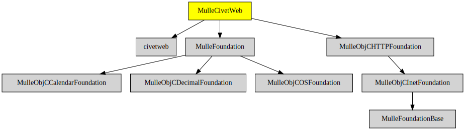

# MulleCivetWeb

#### 🦊 HTTP Server for mulle-objc

MulleCivetWeb is a "WebServer as a library". It is based on
[civetweb](//github.com/civetweb/civetweb).


| Release Version                                       | Release Notes
|-------------------------------------------------------|--------------
|  [](//github.com/MulleWeb/MulleCivetWeb/actions) | [RELEASENOTES](RELEASENOTES.md) |


## Example

You typically interact with MulleCivetWeb by creating a
**MulleCivetWebServer** object, and by attaching a
**MulleCivetWebRequestHandler** to it:


``` objc
@interface MyRequestHandler : NSObject < MulleCivetWebRequestHandler>
@end


int   main( int argc, char *argv[])
{
   MulleCivetWebServer  *server;
   MyRequestHandler     *handler;

   server  = [MulleCivetWebServer object];

   // the server is already running now!
   handler = [MyRequestHandler object];
   [server setRequestHandler:handler];

   return( 0);
}
```

The request handler will receive `MulleCivetWebRequests` and return
`MulleCivetWebResponses`:

``` objc
@implementation MyRequestHandler

- (MulleCivetWebResponse *) webResponseForWebRequest:(MulleCivetWebRequest *) request
{
   MulleCivetWebTextResponse   *response; // subclass of MulleCivetWebResponse

   response = [MulleCivetWebTextResponse webResponseForWebRequest:request];
   [response appendFormat:@"Method is %@\n",
                     [request method] == MulleHTTPPost ? @"POST" : @"GET"]
   [response appendFormat:@"Accept-Encoding is %@",
                     [request headerValueForKey:MulleHTTPAcceptEncodingKey]];
   [response appendString:@"Hello World"];
   return( response);
}

@end
```

That's it.


## API

MulleCivetWeb add the following principal classes:

| Class                       | Description
|-----------------------------|-----------
| `MulleCivetWebServer`       | The WebServer class. Add your request handler to it.
| `MulleCivetWebRequest`      | Requests as received by the MulleCivetWebServer
| `MulleCivetWebResponse`     | Responses returned by a request handler. They contain header | information and the reponse content.
| `MulleCivetWebTextResponse` | Subclass of MulleCivetWebResponse to produce plain text, JSON, | HTML...


### You are here




## Add

Use [mulle-sde](//github.com/mulle-sde) to add MulleCivetWeb to your project:

``` sh
mulle-sde add github:MulleWeb/MulleCivetWeb
```

## Install

### Install with mulle-sde

Use [mulle-sde](//github.com/mulle-sde) to build and install MulleCivetWeb and all dependencies:

``` sh
mulle-sde install --prefix /usr/local \
   https://github.com//MulleCivetWeb/archive/latest.tar.gz
```

### Manual Installation

Install the requirements:

| Requirements                                 | Description
|----------------------------------------------|-----------------------
| [MulleObjCHTTPFoundation](https://github.com/MulleWeb/MulleObjCHTTPFoundation)             | 🎫 HTTP and HTML utility methods and classes for mulle-objc
| [MulleFoundation](https://github.com/MulleFoundation/MulleFoundation)             | 💍 Umbrella library for the MulleFoundation
| [mulle-objc-list](https://github.com/mulle-objc/mulle-objc-list)             | 📒 Lists mulle-objc runtime information contained in executables.

Download the latest [tar](https://github.com/MulleWeb/MulleCivetWeb/archive/refs/tags/latest.tar.gz) or [zip](https://github.com/MulleWeb/MulleCivetWeb/archive/refs/tags/latest.zip) archive and unpack it.

Install **MulleCivetWeb** into `/usr/local` with [cmake](https://cmake.org):

``` sh
cmake -B build \
      -DCMAKE_INSTALL_PREFIX=/usr/local \
      -DCMAKE_PREFIX_PATH=/usr/local \
      -DCMAKE_BUILD_TYPE=Release &&
cmake --build build --config Release &&
cmake --install build --config Release
```

### Platforms and Compilers

All platforms and compilers supported by
[mulle-c11](//github.com/mulle-c/mulle-c11).


## Author

[Nat!](https://mulle-kybernetik.com/weblog) for Mulle kybernetiK  

